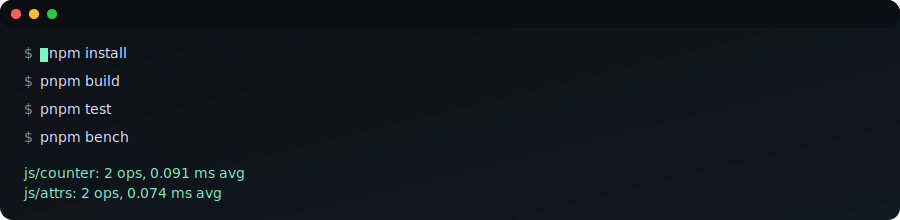

# Mohi


Mohi is a standards-first, server-driven framework inspired by Mohism. It is built around a simple idea: render on the server, stream minimal DOM patches, and keep the client thin. No hydration by default. Islands when you need client-side code.

## Quick demo



## Why Mohi

- Server-driven live UI with a persistent link and tiny patches.
- Resumability by default; the client only handles events and patches.
- Deterministic manifests and policy checks to keep projects honest.
- A path to microfrontends without duplicating runtime code.
- Batteries-included defaults with a small, explicit plugin surface for extensions.

## Mohist-inspired design

- Frugality: minimal client runtime and patch-first updates to avoid duplicate work.
- Determinism: stable manifests, event logs, and replayable sessions over hidden magic.
- Standards-first: Web APIs and portable runtimes instead of bespoke platform lock-in.
- Composable governance: explicit budgets, policies, and module boundaries that scale.

## Current status

Pre-alpha (0.0.1-prealpha). The core live loop is in place with a minimal protocol, runtime session queue, patch delivery, and a playground server. Diffing and patch ops are basic and will evolve quickly.

## Getting started

```bash
pnpm install
pnpm build
pnpm test
pnpm bench
pnpm -C apps/playground dev
```

## Docs

- `spec.md` - product and architecture spec
- `statement.md` - competitive positioning statement
- `LICENSE` - CC BY-SA 4.0

## Performance

Benchmarks run in CI and upload `benchmarks/last-report.json` as an artifact on each run.

License: CC BY-SA 4.0
